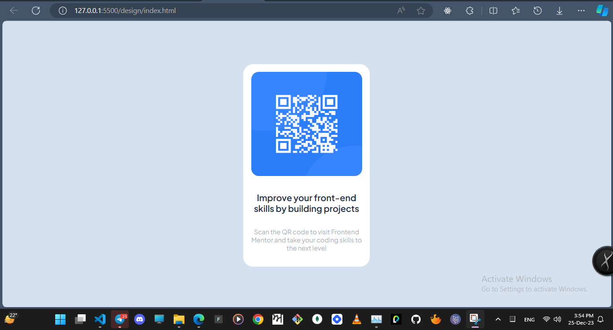

# Frontend Mentor - QR code component solution

This is a solution to the [QR code component challenge on Frontend Mentor](https://www.frontendmentor.io/challenges/qr-code-component-iux_sIO_H). Frontend Mentor challenges help you improve your coding skills by building realistic projects. 

## Table of contents

- [Overview](#overview)
  - [Screenshot](#screenshot)
  - [Links](#links)
- [My process](#my-process)
  - [Built with](#built-with)
- [Author](#author)

## Overview

### Screenshot

### Links

- Live Site URL: [Add live site URL here] (https://qr-code-card-opal.vercel.app/)

## My process

### Built with

- Semantic HTML5 markup
- CSS custom properties
- Flexbox
- Google Fonts (https://fonts.google.com/specimen/Outfit)

## Author

- Frontend Mentor - [@rahulkumarpahwa](https://www.frontendmentor.io/profile/rahulkumarpahwa)
- Twitter - [@rahulkumarpahwa](https://www.twitter.com/rahulkumarpahwa)

